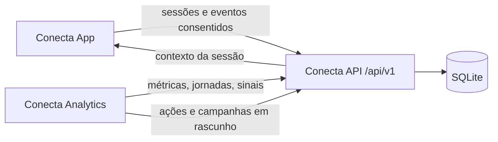

# Conecta API

Backend do CONECTA para o Hackathon Conexão Ancestral, Petronect + KODIE Academy. A API é a fonte de verdade dos três repositórios: recebe eventos do App, valida e persiste dados fictícios, processa jornadas, expõe métricas para o Analytics e registra campanhas/recomendações sem disparo automático.

API publicada no Render: https://conecta-api-2x27.onrender.com

> Protótipo funcional com dados simulados. Não há integração com o Portal Petronect real, CRM, envio de mensagens ou dados pessoais reais.

## Arquitetura



## Executar localmente

```sh
npm ci
npm run setup
npm run seed
npm run check
npm test
npm start
```

Saúde local: http://127.0.0.1:3000/health

Swagger/OpenAPI: http://127.0.0.1:3000/api-docs

O `setup` cria `.env` com `ADMIN_TOKEN`, `DEMO_ADMIN_EMAIL` e `DEMO_ADMIN_PASSWORD`. O `seed` cria uma base fictícia com 37 eventos, 6 perfis e 9 sessões quando o banco ainda está vazio. O servidor também executa essa mesma proteção no boot, para que a demonstração publicada não comece sem dados.

## Respostas padronizadas

Sucesso:

```json
{ "success": true, "message": "", "data": {} }
```

Erro:

```json
{ "success": false, "message": "", "errors": [] }
```

Campos legados importantes também permanecem no topo da resposta para manter compatibilidade com clientes já existentes.

## Endpoints

| Grupo | Endpoints |
| --- | --- |
| Saúde e documentação | `GET /health`, `GET /api-docs`, `GET /api-docs/openapi.json` |
| Autenticação | `POST /api/v1/auth/login`, `GET /api/v1/auth/me`, `POST /api/v1/auth/logout` |
| App/Jornada | `GET /api/v1/catalog`, `POST /api/v1/sessions`, `GET /api/v1/sessions/:id/context`, `PATCH /api/v1/sessions/:id/preferences`, `POST /api/v1/sessions/:id/events` |
| Analytics | `GET /api/v1/admin/summary`, `GET /api/v1/admin/dashboard`, `GET /api/v1/admin/journeys`, `GET /api/v1/admin/signals`, `GET /api/v2/admin/signals`, `GET /api/v1/admin/recommendations` |
| Gestão | `PATCH /api/v1/admin/signals/:id`, `GET /api/v1/admin/audit`, `GET/POST /api/v1/admin/users`, `GET/POST/PATCH /api/v1/admin/campaigns` |
| Relatórios | `GET /api/v1/admin/events.csv`, `GET /api/v1/admin/reports/events.csv` |

## Recursos implementados

- TypeScript com contratos explícitos, DTOs e validação de entrada.
- Tratamento global de erros, logs estruturados, CORS, rate limit, health check e versionamento `/api/v1`.
- Autenticação administrativa por `ADMIN_TOKEN` ou login com sessão.
- Sessões demonstrativas, consentimento, retirada da coleta e eventos idempotentes.
- Métricas, jornadas, sinais históricos v2, auditoria e CSV seguro.
- Usuários administrativos e campanhas em rascunho vinculadas a sinais.
- Banco SQLite com relações entre perfis, sessões, eventos, ações, auditoria, usuários, campanhas e sinais.

## Variáveis

| Variável | Finalidade |
| --- | --- |
| `HOST` | Host HTTP. Padrão local: `127.0.0.1` |
| `PORT` | Porta HTTP. Padrão: `3000` |
| `DB_PATH` | Caminho do SQLite |
| `DEMO_READ_ONLY` | `true` bloqueia mutações e libera GET administrativos públicos |
| `ADMIN_TOKEN` | Token administrativo com pelo menos 32 caracteres |
| `DEMO_ADMIN_EMAIL` | E-mail do login administrativo demo |
| `DEMO_ADMIN_PASSWORD` | Senha do login administrativo demo |
| `ALLOWED_ORIGINS` | Origens permitidas para App e Analytics |

## Render

Serviço atual: `conecta-api`

Service ID: `srv-dalbqo2jnfac73915ktg`

URL: https://conecta-api-2x27.onrender.com

Configure `ALLOWED_ORIGINS` com os domínios publicados do App e do Analytics. Para demonstração gravável, use `DEMO_READ_ONLY=false`; para apresentação pública sem escrita, use `DEMO_READ_ONLY=true`.

Outbound IPs compartilhados informados pelo Render: `74.220.50.0/24` e `74.220.58.0/24`. Eles não são exclusivos do serviço. Se algum serviço externo exigir allowlist única, será necessário Dedicated IP no Render.

## Integração dos três repositórios

Com `conecta-app`, `conecta-api` e `conecta-analytics` em pastas irmãs:

```sh
npm run check:integration
```

O teste sobe a API em porta temporária e valida coleta, contexto, sinais, auditoria, campanhas, CSV e retirada da coleta usando os clientes dos outros repositórios.

## Limites

SQLite e processamento em memória servem ao protótipo. Antes de uso real, será preciso definir banco gerenciado, retenção, backup, observabilidade, autenticação corporativa, política LGPD, segregação por organização e operação de campanhas.
